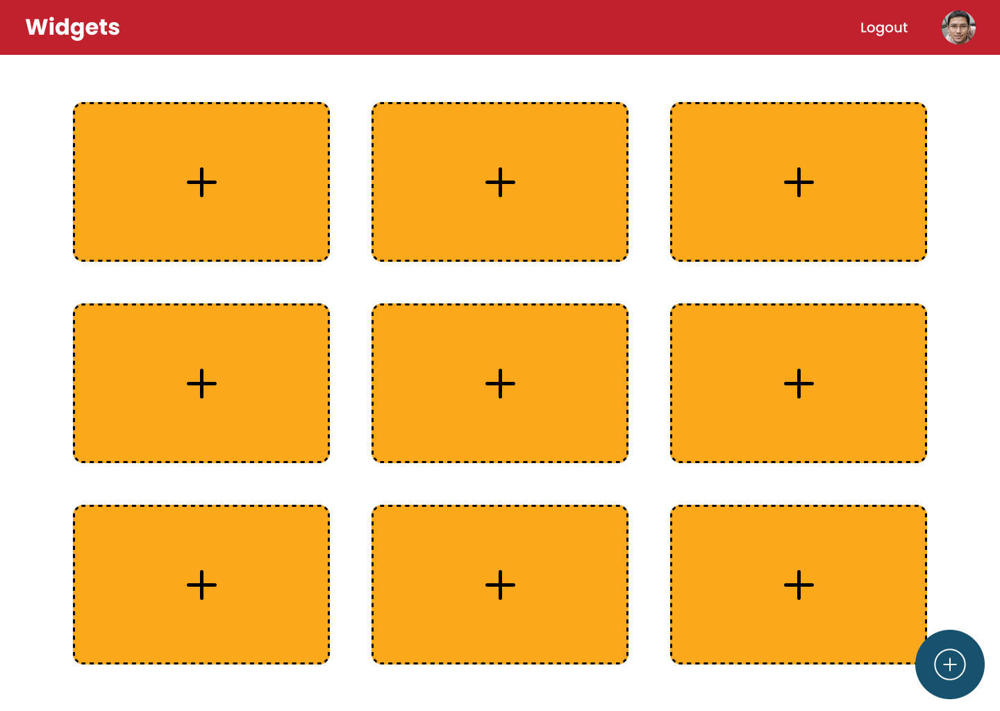

### This website was built using the following technologies:

- Laravel Framwork
- Breeze starter kit
- Grid Stack JS
- Chart JS

<br><br>

### Mockups

- Project Figma design [figma](https://www.figma.com/design/W9lJJ1SVD5TGJ4J5joGzRQ/Untitled?node-id=0-1&t=57rpJQCS5S0IDrE8-1)

| Main screen                            | Add Widgets Bar                         |
| -------------------------------------- | --------------------------------------- |
|           |  |

<br><br>

> To set up Lingo Quest locally, follow these steps:

### Installation

_Below is an example of how you can run this website locally._

1. Clone the repo
   git clone [github](https://github.com/arefabouhamdan/widgets)

2. Change directory to widget
   ```sh
   cd widgets-main
   ```

4. Install dependencies
    ```sh
    composer install
    npm install
    ```

5. Open two terminals:

5. 1. In the first terminal:
    ```sh
    composer run dev
    ```

5. 2. In the second terminal:
   ```sh
   php artisan seve
   ```

6. Create an account
